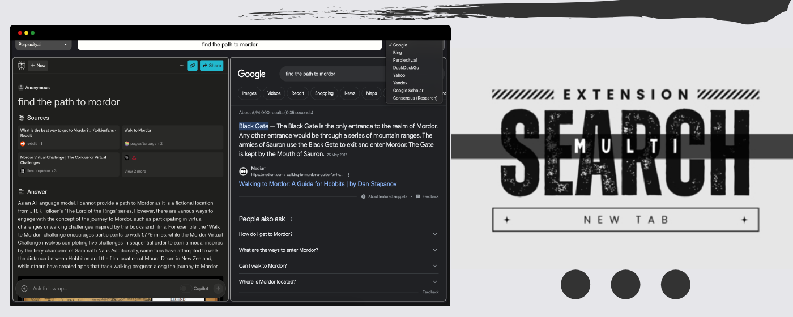
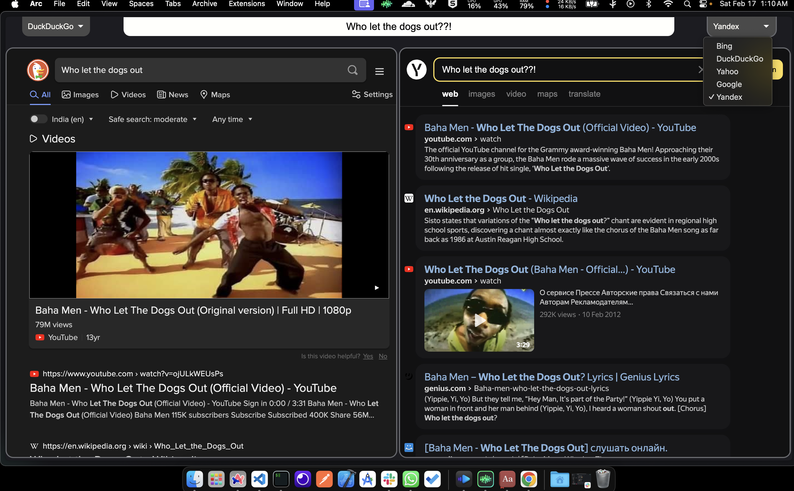
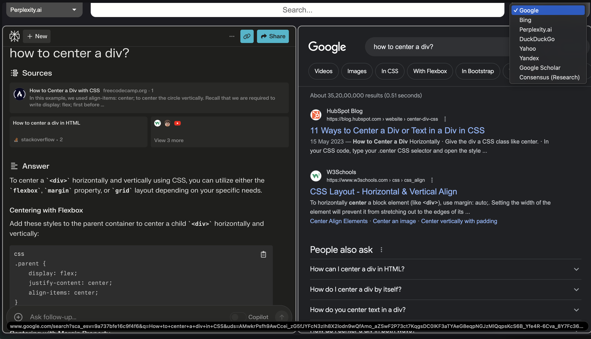
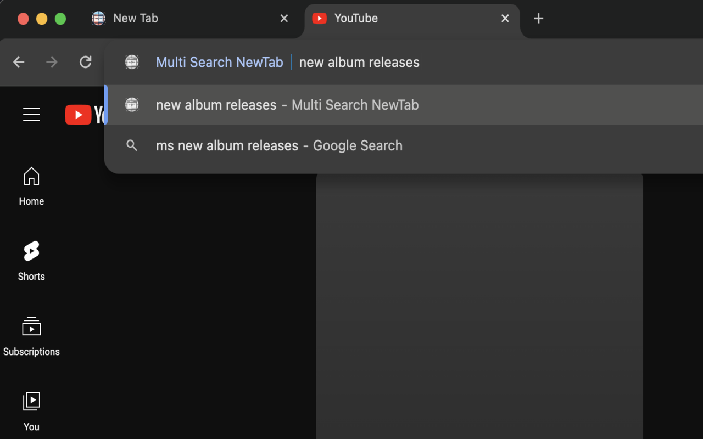

# Landing page for Multi Search NewTab



Are you tired of toggling between different search engines to find the precise information you need? Multi Search NewTab changes the way you search by amalgamating the power of multiple search engines into one convenient new tab. It's simple yet efficient!euismod.

## 👾 Instructions for use:

-> Simply enter you search query on the top most search bar after opening a new tab.

-> Select your preferred search engine via drop-down menu available on top left and the top right side for left and right windows respectively.

-> Write " ms " in url search/address bar of your browser and press on your keyboard, the extension will then take over any further words you press as search query! (hit enter in the end to search) | ms stands for Multi Search :D

-> To navigate backwards, select one of the two split windows (left or right) and press your browser's back button.

-> You can also think of left and right split windows as individual tabs and use them as such.

## Stats

🚀 Already over 130 users and counting 🥳

## Outlook

🔍 The Problem: I found myself constantly juggling between multiple search engines, tab after tab, in my quest for information. It was a real hassle, especially during those deep dive knowledge hunts at work.

🌟 The Solution: A clean new tab page that consolidates search engines and unlocks split tabs in a single tab, boosting productivity and reducing search times. Also, no more frantic tab-switching!

I am really excited about how much it has helped me and I believe it may do the same for you. Give it a whirl and let the knowledge hunt be as seamless as it should be!

## Screenshots








## How to use this repo

Execute [`create-next-app`](https://github.com/vercel/next.js/tree/canary/packages/create-next-app) with [npm](https://docs.npmjs.com/cli/init), [Yarn](https://yarnpkg.com/lang/en/docs/cli/create/), or [pnpm](https://pnpm.io) to bootstrap the example:

```bash
npx create-next-app --example blog-starter blog-starter-app
```

```bash
yarn create next-app --example blog-starter blog-starter-app
```

```bash
pnpm create next-app --example blog-starter blog-starter-app
```

Your blog should be up and running on [http://localhost:3000](http://localhost:3000)! If it doesn't work, post on [GitHub discussions](https://github.com/vercel/next.js/discussions).

Deploy it to the cloud with [Vercel](https://vercel.com/new?utm_source=github&utm_medium=readme&utm_campaign=next-example) ([Documentation](https://nextjs.org/docs/deployment)).

# Notes

`blog-starter` uses [Tailwind CSS](https://tailwindcss.com) [(v3.0)](https://tailwindcss.com/blog/tailwindcss-v3) along with markdown.
